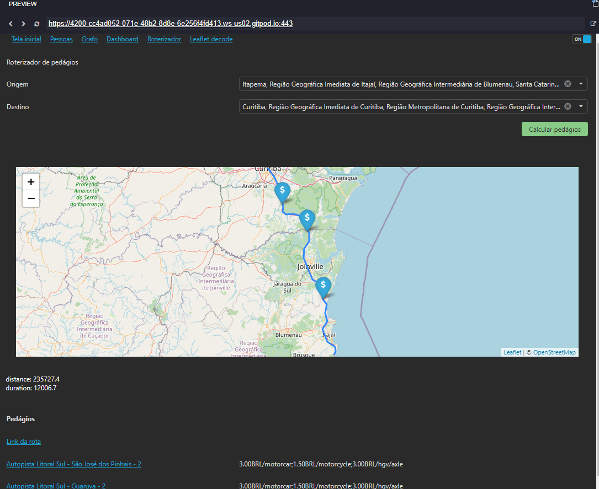

# Meus Projetos Teste

Exemplo das telas

## 👨🏼‍💻 Projeto

Meu projetos testes é um repositório feito pra rodar nos container da gitpod.io com o foco nos meus estudos.

## 🔨 Tecnologias

- [JavaScript](https://developer.mozilla.org/pt-BR/docs/Aprender/JavaScript)
- [TypeScript](https://www.typescriptlang.org/)
- [Node.js](https://nodejs.org/en/)
- [Angular](https://angular.io/)
- [DevExtreme](https://js.devexpress.com/)
- [Leaflet](https://leafletjs.com/)
- [Dexie](https://dexie.org/)
- [IndexedDB](https://developer.mozilla.org/en-US/docs/Web/API/IndexedDB_API)

## 🔄 Executar
 - Fazer clone do repositório.

### 🔧 Back-end
 - Trabalho em progresso...

### 💻 Front-end
 - Entrar na pasta `web`;
 - Executar `yarn install` para instalar dependências do projeto;
 - Executar `yarn start` para que o projeto seja executado;

### 📱 Mobile
- Trabalho em progresso...

## ♻️ Como contribuir
- Faça um fork desse repositório;
- Crie uma branch com a sua feature: `git checkout -b minha-feature`
- Commit suas mudanças: `git commit -m ':emoji: feat: My new feature'`
- Push a sua branch: `git push origin my-feature`

## 📝 Licença
Este projeto está sobre a licença MIT. Veja o arquivo [LICENSE](LICENSE.md) para mais detalhes.

---

<h4 align="center">
  Feito com ❤️ by Willian Luis Zuqui
</h4>